# Dvojitý laboratorní zdroj 30V / 3.5A

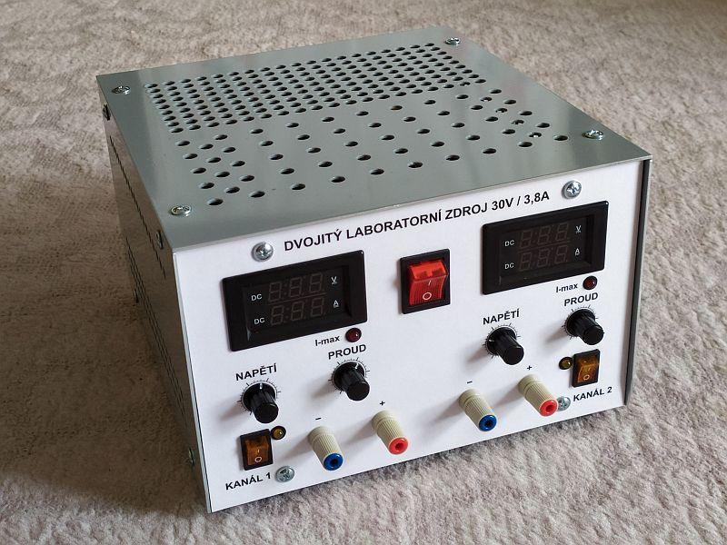

Napájecí zdroj s nastavitelným výstupním napětím 0-30V a nastavitelným omezením výstupního proudu 0-3.5A. Omezení proudu je indikováno červenou LEDkou.
Jedná se o dvoukanálový laboratorní zdroj.  Maximální proud, který jsem dostal z kanálu 1 je 3.5A a z kanálu 2 3.7A (po zkratování výstupních svorek). 
Použitý transformátor má několik sekundárních vinutí. Z nich jsem využil dvě hlavní, každé s výstupem 25V/4A a dvě pomocná s výstupem 12V/2A pro napájení panelových měřidel a ventilátorů. 
Zapnutí ventilátorů jsem nastavil na teplotu tranzistorů 60C, vypíná se při 46C. 
Čelní panel jsem nakreslil v Inkscape, vytiskl a potom přežehlil laminovací folií pro lepší vzhled, zpevnění a také ochranu tisku. 
Pro regulaci výstupního napětí a omezení proudu jsou použity 5-ti otáčkové potenciometry. 
Rozměr zdroje je 24cm x 15cm x 25cm, větrací otvory mají průměr 7mm a rozteč 10.4mm.

## Měření tvrdosti zdroje

| **nastavené napětí / napětí po zatížení (kanál 1 / kanál 2)** | **0.45A**   | **0.89A**   | **1.82A**     | **3A**         | **3.5A**      |
| :-----------------------------------------------------------: | :---------: | :---------: | :-----------: | :------------: | :-----------: |
| 5V                                                            | 5V / 5V     | 5V / 5V     | 5V / 5V       | 5V / 5V        | 5V / 5V       |
| 10V                                                           | 10V / 10V   | 10V / 10V   | 10V / 10V     | 10V / 10V      | 10V / 10V     |
| 20V                                                           | 20V / 20V   | 20V / 20V   | 20V /20V      | 20V / 20V      | 20V / 20V     |
| 25V                                                           |             |             |               | 24.5 V / 24.2V | 23.6V / 23.6V |
| 30V                                                           | 30V / 29.8V | 29V / 28.8V | 26.8V / 26.7V |                |               |

## Měření teplot a proudů (při otevřeném šasi)

|                                                       | nastavený proud  | Kanál 1  | Kanál 2  |
| ----------------------------------------------------- | :--------------: | :------: | :------: |
| Teplota tranzistorů KD502 (bez zapnutého ventilátoru) | 1A               | 54C      | 58C      |
| Teplota tranzistorů KD502 (bez zapnutého ventilátoru) | 2A               | přes 70C | přes 80C |
| Teplota tranzistorů KD502 (se zapnutým ventilátorem)  | 2A               | 55C      | 63C      |
| Teplota tranzistorů KD502 (se zapnutým ventilátorem)  | 3A               | 65C      | 76C      |
| Teplota tranzistorů KD502 (se zapnutým ventilátorem)  | max. 3.5A / 3.7A | 67C      | 84C      |
| Teplota rezistorů R7 a R8                             | 3A               | 80C      | 81C      |
| Teplota rezistorů R7 a R8                             | max. 3.5A / 3.7A | 92C      | 107C     |

## Seznam součástek

| **Ref**                          | **Qnty** | **Value**                               | **Cmp name** |
| -------------------------------- | :------: | --------------------------------------- | ------------ |
| 230V1,                           | 1        | 230V                                    | Conn\_01x02  |
| C1, C2,                          | 2        | 4700uF/63V/105C                         | CP           |
| C3, C4,                          | 2        | 47uF/50V                                | CP           |
| C5,                              | 1        | 220n CF1                                | C            |
| C6, C9,                          | 2        | 100pF                                   | C            |
| C7,                              | 1        | 10uF/50V                                | CP           |
| C8,                              | 1        | 330pF                                   | C            |
| C10, C14,                        | 2        | 100nF                                   | C            |
| C13,                             | 1        | 330nF                                   | C            |
| C15, C16,                        | 2        | 1000uF/25V                              | CP           |
| D1, D2, D3, D4,                  | 4        | P1000M                                  | D            |
| D5, D6,                          | 2        | 1N4148                                  | D            |
| D7,                              | 1        | 1N4734A (5V6)                           | D\_Zener     |
| D8,                              | 1        | BZX83V005.6                             | D\_Zener     |
| D9, D10,                         | 2        | 1N4148                                  | D            |
| D11, D14,                        | 2        | S1M                                     | D            |
| D12,                             | 1        | LED 5mm červená                         | LED          |
| D13,                             | 1        | KBP307                                  | KBP307       |
| D15,                             | 1        | LED 5mm žlutá                           | LED          |
| F1,                              | 1        | 6A                                      | Fuse         |
| F2,                              | 1        | 500mA                                   | Fuse         |
| F3,                              | 1        | 2A                                      | Fuse         |
| IO1, IO2, IO3,                   | 3        | TL071                                   | TL071        |
| J1,                              | 1        | výstup na svorky                        | Conn\_01x02  |
| J2,                              | 1        | výstup na externí tranzistory           | Conn\_01x03  |
| J3,                              | 1        | napájení panelového měřidla             | Conn\_01x02  |
| M1,                              | 1        | ventilátor                              | Fan          |
| P1, P2,                          | 2        | 10K (5ot.)                              | R\_Variable  |
| R1,                              | 1        | 2K2/2W                                  | R            |
| R2,                              | 1        | 220R                                    | R            |
| R3,                              | 1        | 82R                                     | R            |
| R4, R29,                         | 2        | 4K7                                     | R            |
| R5, R6, R13, R20, R21, R28, R30, | 7        | 10K                                     | R            |
| R7, R8,                          | 2        | 1R0/10W                                 | R            |
| R9, R19,                         | 2        | 2K2                                     | R            |
| R10,                             | 1        | 270K                                    | R            |
| R11, R25,                        | 2        | 27K                                     | R            |
| R12, R18,                        | 2        | 56K                                     | R            |
| R14,                             | 1        | 1K5                                     | R            |
| R15, R16, R32,                   | 3        | 1K0                                     | R            |
| R17,                             | 1        | 33R                                     | R            |
| R22,                             | 1        | 1K8                                     | R            |
| R23, R24,                        | 2        | 0R33/5W                                 | R            |
| R26,                             | 1        | 100K                                    | RTRIM        |
| R27,                             | 1        | 10K                                     | RTRIM        |
| R31,                             | 1        | 1M5                                     | R            |
| R33,                             | 1        | 1K8                                     | R            |
| SW1,                             | 1        | Hlavní vypínač                          | SW\_DPST     |
| SW2,                             | 1        | Vypínač                                 | SW\_DPST\_2  |
| T1, T2, T6,                      | 3        | MMBT2222                                | Q\_NPN\_BEC  |
| T3,                              | 1        | BC857                                   | Q\_PNP\_BEC  |
| T4, T5,                          | 2        | KD502                                   | Q\_NPN\_BEC  |
| TH1,                             | 1        | KTY81-210                               | KTY81        |
| TR1,                             | 1        | Trafo                                   | Trafo        |
| U2,                              | 1        | L7812                                   | L7812        |
| U3,                              | 1        | LM358                                   | LM358        |
|                                  |          |                                         |              |
|                                  | 2        | hmatník na potenciometry                |              |
|                                  | 2        | konektor, banánky                       |              |
|                                  | 2        | mřižka na ventilátor                    |              |
|                                  | 1        | chladič S25AN (15C/W) na TO-220 (L7812) |              |
|                                  | 1        | panelové měřidlo                        |              |
|                                  | 1        | chladič pro KD502                       |              |

## Další obrázky

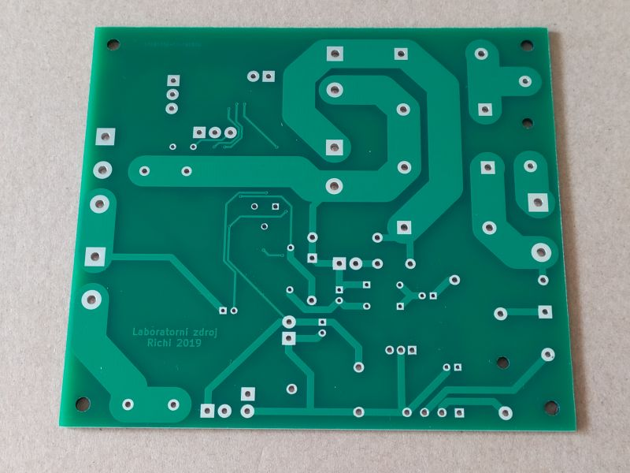
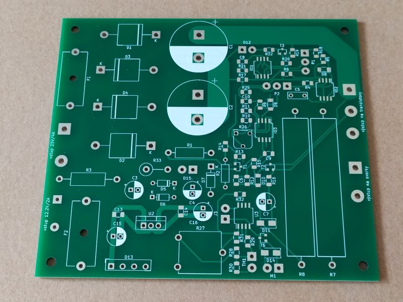

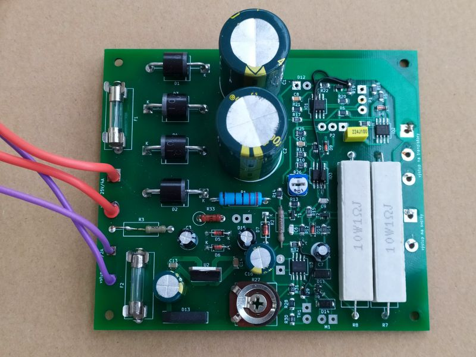
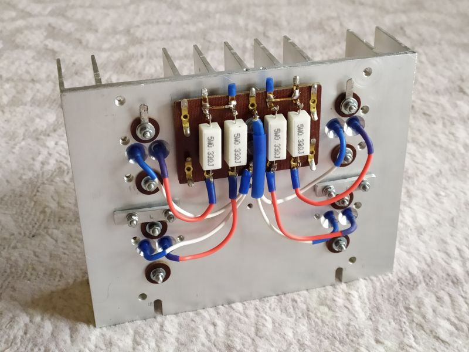
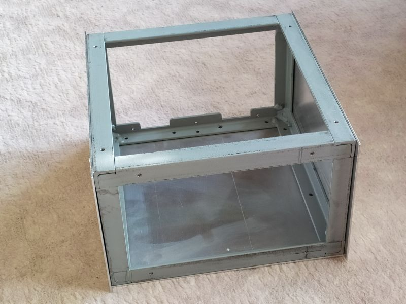
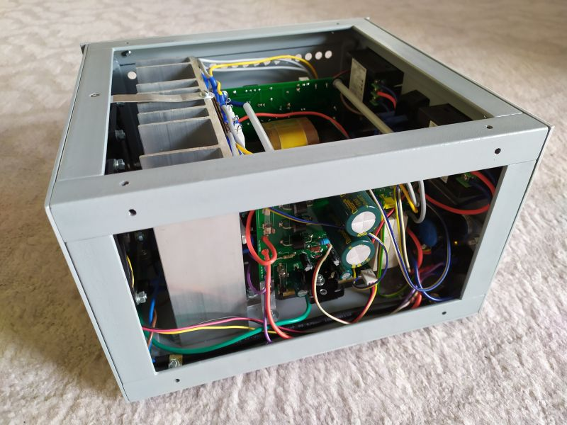
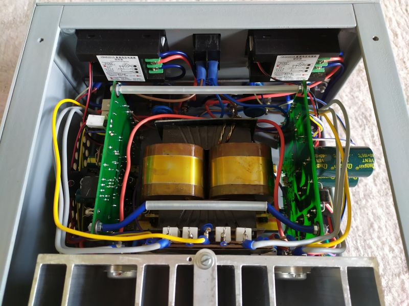
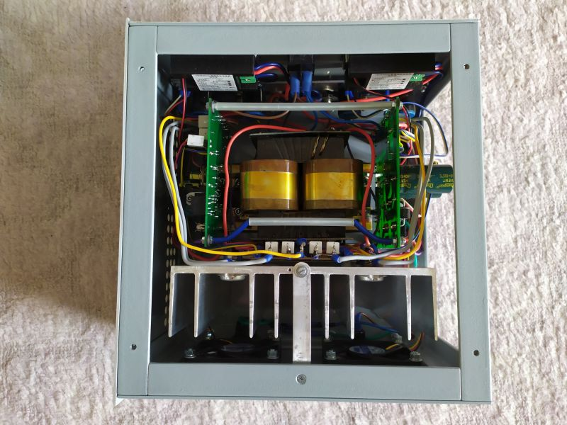
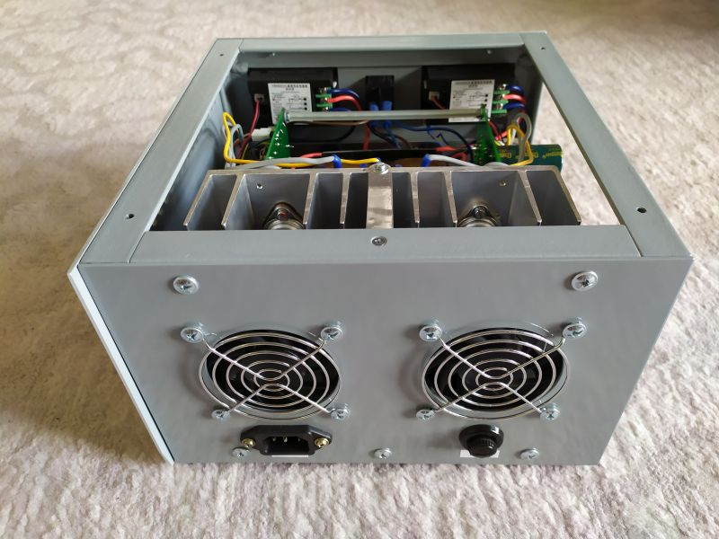
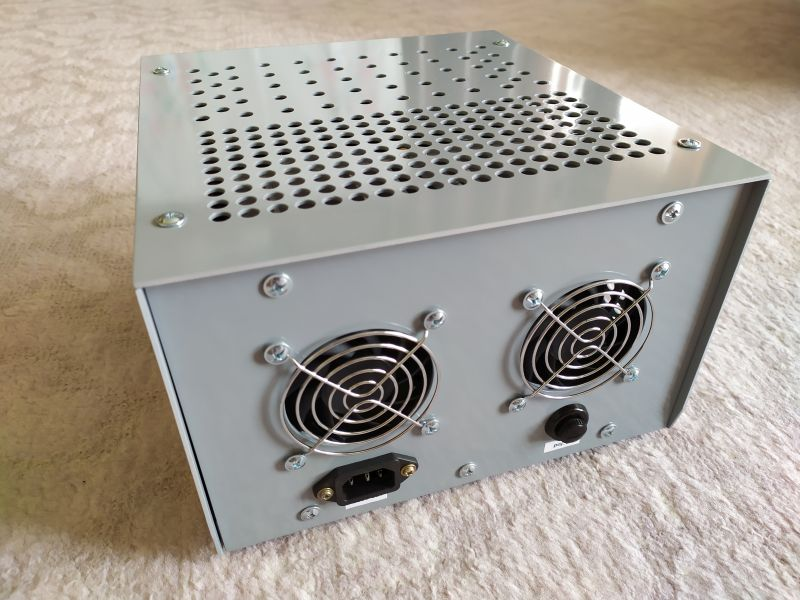

Původní zapojení, ze kterého jsem vycházel, je [tady](http://bcmp.cz/laboratorni-zdroj-0-30v-2ma-4a/).
